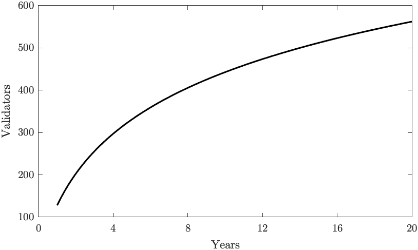

> NOTE: This paper is a work in progress and intended for PRIVATE distribution only.

# Introduction

Akash is a permissionless marketplace trade compute cycles. In this paper, we present the Akash Token (AKT) model that’s designed to a) maintain ecosystem sovereignty, b) provide economic security, and c) encourage early adoption. Some definitions:

Akash Token (AKT)

:  AKT is the native token of the Akash Network. The core utility of AKT is to act as a staking mechanism to secure the network and normalize compute prices for the marketplace auction. The amount of AKTs staked towards a validator defines the frequency by which the validator may propose a new block and its weight in votes to commit a block. In return for bonding (staking) to a validator, an AKT holder becomes eligible for block rewards (paid in AKT) as well as a proportion of transaction fees (paid in any of the whitelisted tokens).

Validator 

:   Validators secure the Akash network by validating and relaying transactions, proposing, verifying and finalizing blocks. There will be a limited set of validators, initially 64, which are required to maintain a high standard of automated signing infrastructure. Validators charge *delegators* a commission fee in AKT.

Delegator

:   Delegators are holders of the AKT and use some or all of their tokens to secure the Akash chain. In return, delegators earn a proportion of the transaction fee as well as block rewards.

Provider

:  Providers offer computing cycles (usually unused) on the Akash network and earn a fee for their contributions. Providers are required to maintain a stake in AKT as collateral, proportional to the hourly income earned; hence, every provider is a delegator and/or a validator.

Tenants

:   Tenants lease computing cycles offered by providers for a market-driven price (set using a reverse auction process).

## Marketplace Overview

Akash provides a novel spot market to lease containers. A container is a unit of computing ($U \equiv \{ CPU, Memory, Disk \}$), which can run any type of cloud application. With Akash, early adopters can enjoy over 8x lower cost than the current market. 

All marketplace transactions are persisted on the Akash blockchain. To lease a container, the tenant (developer) requests a deployment by specifying the type(s) of unit(s), and the quantity of each type of unit. To specify a type of unit, the tenant specifies attributes to match, such as region (e.g. US) or privacy features (e.g. Intel SGX). The tenant also specifies the maximum price they're willing to pay for each type of unit.

An order is created in the order book (upon acceptance by a validator).

The provider(s) that match all the requirements of the order then place a bid by competing on price using a `SubmitFulfillment` transaction. The provider that bids the lowest amount on the `Order` wins, upon which a `Lease` is created between the tenant and the provider for the order.

## Proof of Stake using Tendermint Consensus

Akash employs a blockchain secured by a *Proof-of-Stake* consensus model as a Sybil resistance mechanism for determining participation in its consensus protocol and implements the Tendermint [@tendermint] algorithm for Byzantine fault-tolerant consensus. Tendermint was designed to address the speed, scalability, and environmental concerns with Proof of Work with the below set of properties:

a) Validators take turns producing blocks in a weighted round-robin fashion, meaning the algorithm has the ability to seamlessly change the leader on a per-block basis.

b) Strict accountability for Byzantine faults allows for punishing misbehaving validators and providing economic security for the network.

Anyone who owns an Akash token can bond (or delegate) their coins and become a validator, making the validator set open and permissionless. The limited resource of Akash tokens acts as a Sybil prevention mechanism.

Voting power is determined by a validator’s bonded stake (not reputation or real-world identity). No single actor can create multiple nodes in order to increase their voting power as the voting power is proportional to their bonded stake. Validators are required to post a “security deposit” which can be seized and burned by the protocol in a process known as “slashing”.

These security deposits are locked in a bonded account and only released after an “unbonding period” in the event the staker wishes to unbond. Slashing allows for punishing bad actors that are caught causing any attributable Byzantine faults that harm the well-functioning the system.

The slashing condition and the respective attributable Byzantine faults and punishments are beyond the scope of this paper.

### Limits on Number of Validators

Akash's blockchain is based on Tendermint consensus which gets slower with more validators due to the increased communication complexity. Fortunately, we can support enough validators to make for a robust globally distributed blockchain with very fast transaction confirmation times, and, as bandwidth, storage, and parallel compute capacity increases, we will be able to support more validators in the future.

On Genesis day, the number of validators $V_i$ is set to $V_i(0) = V_{i,0} = 128$ and the number of validators at time $t~year$ will be:

$$
V_n(t) = | \log_2(t+1) \cdot V_{i,0} |
$$

So, in $10~years$, there will be $V_n(10) = 442$ validators as illustrated in [@fig:validator-count]

{#fig:validator-count}
