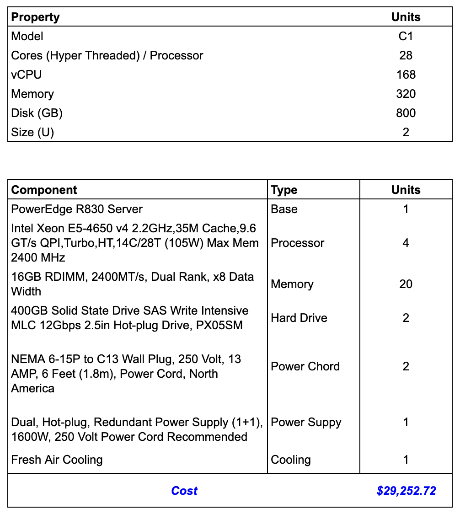
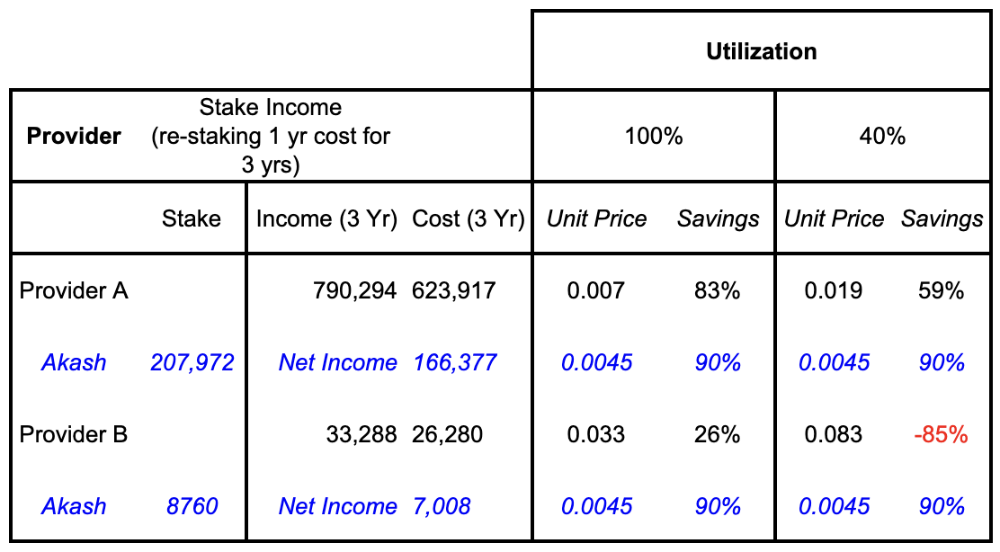

# Provider Economics

In section, we present economics for a provider offering computing services on Akash. 

First, let us examine the current pricing model on popular cloud infrastructure providers, Amazon Web Services (AWS), Google Compute Platform (GCP), and Microsoft Azure. Most providers now offer virtualized computing packaged as *containers*.

## Unit Economics
The unit cost for a container at a given time $t$ can be calculated using:

$$
UnitCost(t) = \frac{ServerCost(t)}{UnitYield \times Utilization(t)}
$$

where `ServerCost` is the capital and operational expenditure for the server and `Utilization` the amount of resources consumed without the operating overheard. 

As of the writing of this paper, the current prices to lease a *container-unit* (1 GB Memory and 1 CPU) for an hour are as follows:

- AWS[^1] : 0.045
- GCP[^2] : 0.036 
- Azure[^3] : 0.054 

[^1]: Amazon Web Services on-demand pricing for ECS (Fargate) in US East (https://aws.amazon.com/fargate/pricing)
[^2]: Google Compute Engine on-demand pricing in US Central (https://cloud.google.com/compute/all-pricing)
[^3]: Microsoft Azure on-demand pricing in US Central (https://azure.microsoft.com/en-us/pricing/details/container-instances)

Lets us now determine a provider's cost-benefit to offer containers by considering two possible scenarios a) provider wants to recover capital by offering excess capacity (at-cost) b) provider wants to offer a bare-metal cloud instance for profit (at-margin) 
 
### At Cost: Capital Recovery on Server Cabinet

In this scenario, consider {Provider_A} has a fleet of underutilized servers and intends to recover deployed capital and subsidize operating expenditure. These servers -- also referred to as "rack units" -- are enclosed in a *cabinet* hosted at a datacenter. A server cabinet also referred to as a "rack," is a standardized enclosure for mounting multiple servers. Datacenter providers typically charge by cabinet for electricity, real estate, and high-performance internet connectivity.

Considering a typical cabinet costs around USD *559,176* in capital expenditure and USD *1,800* in operating expenditure as illustrated in [@fig:cabinet-cost] with a shelf life (time for performance deprecation to sub-optimal levels) of *3 years*, the provider needs to earn $559,176 + 1800 \times 3 \times 12 = 688,776$ USD (or 229,592 USD / Year) for full capital recovery.

Considering a unit yield of *3,192 per Cabinet*, at 100% utilization, the provider can offer a container for no less than *0.013* USD and, at 40% utilization, the price will be *0.034* USD.

![Server cabinet specification with capital and operating expenditures for a unit that can enclose 19 cloud-grade servers illustrated in [@fig:rack-cost].](figures/cabinet-cost.png){#fig:cabinet-cost}

{#fig:rack-cost}

### At Margin: Mid Tier Cloud Provider

In this scenario, $Provider_B$ leases a bare-metal server from a cloud provider such as [Packet](https://www.packet.com/) and intends to offer containers for a profit. In the case of $Provider_B$, a bare-metal server, such as `c2.medium.x86` on Packet with 30 CPUs and 64GB Memory can yield $\approx 30~\text{container units}$ and costs $1~\text{USD/Hr}$, for which the *price per unit-hr* at 100% utilization will be $1/(30 \times 1) \approx 0.033$ USD and at a more realistic 40% utilization to be $1/(30 \times 0.4) \approx 0.83$ USD respectively.

At 100% utilization, the cost savings are marginal (*< 2x*), which is not a very compelling reason for a user to switch to Packet from AWS. Additionally, when adjusted for utilization risk, Packet needs to sell the container for close to 2x the AWS price point to break even.

The utilization risk combined with a low-value proposition is a reason why providers like Packet refrain from offering container service to their customers.

## Akash Advantage

By capitalizing on AKT's staking rewards, both Provider A and Provider B will be to offer an exponentially 

